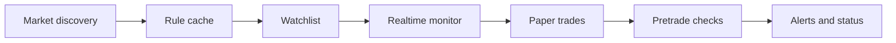

# poly_strategy

[](https://github.com/WW-shan/poly_strategy/actions/workflows/ci.yml)
[](LICENSE)
[](https://github.com/WW-shan/poly_strategy/releases)
[](pyproject.toml)
[](tests)
[](docs/security.md)
[](docs/security.md)

<p align="center">
  <a href="docs/command-reference.md"></a>
  <a href="docs/pipeline.md"></a>
  <a href="docs/operations.md"></a>
  <a href="https://github.com/WW-shan/poly_strategy/releases/tag/v0.1.0"></a>
</p>

<p align="center">
  
  
  
  
</p>

Prediction-market research and execution-planning toolkit for collecting books, discovering conservative relations, replaying snapshots, and validating dry-run opportunities before anything touches a live account.

Live execution is opt-in and stays behind explicit environment variables, pretrade checks, and risk limits.

## What it covers

| Area | Capability |
| --- | --- |
| Collection | Polymarket Gamma/CLOB, Kalshi, and external signal ingestion |
| Discovery | deterministic relation mining, LLM verification, rule caching |
| Realtime | watchlist building, live book streaming, stable-opportunity monitoring |
| Paper and risk | backtest, paper selection, execution plan checks, risk ledger updates |
| Operations | background manager, LaunchAgents, rotation and pruning helpers |

## Architecture



The detailed pipeline is documented in [docs/pipeline.md](docs/pipeline.md).

## Quick start

```bash
python3.11 -m venv .venv
.venv/bin/python -m pip install -e ".[dev,live]"
cp .env.example .env.local
.venv/bin/python -m pytest
```

Then inspect the CLI:

```bash
.venv/bin/poly-strategy --help
```

## Common workflows

```bash
python -m poly_strategy.cli sample --out data/sample.ndjson
python -m poly_strategy.cli backtest data/sample.ndjson
python -m poly_strategy.cli collect-polymarket --out data/polymarket-gamma.ndjson --limit 20 --timeout 10
python -m poly_strategy.cli discover-rules --raw data/polymarket-gamma.ndjson --out rules/candidate-implications.json
python -m poly_strategy.cli build-watchlist --gamma data/polymarket-gamma.ndjson --rules rules/candidate-implications.json --out data/watchlist.json
python -m poly_strategy.cli realtime-monitor-watchlist --watchlist data/watchlist.json --rules rules/candidate-implications.json --gamma data/polymarket-gamma.ndjson --report-out data/realtime-monitor.jsonl
```

## Docs

- [Command reference](docs/command-reference.md)
- [Pipeline](docs/pipeline.md)
- [Operations](docs/operations.md)
- [Repository layout](docs/repository-layout.md)
- [Security](docs/security.md)
- [Changelog](CHANGELOG.md)
- [Contributing](CONTRIBUTING.md)

## Configuration

| Variable group | Purpose |
| --- | --- |
| `OPENAI_*` | LLM discovery and verifier providers |
| `PROXY` / `OPENAI_PROXY` | local proxy for unstable network paths |
| `ODDPOOL_*` | external signal ingestion and quota control |
| `POLYMARKET_*` | live execution / CLOB integration, guarded by `POLY_STRATEGY_ALLOW_LIVE=1` |
| `ALERT_*`, `TELEGRAM_*`, `DISCORD_*` | notification delivery |

Start from [.env.example](.env.example) and keep `.env.local` untracked.

## Repository layout

- `poly_strategy/`: core package
- `scripts/`: recurring jobs and operational helpers
- `tests/`: unit tests
- `docs/`: architecture, operations, and command reference
- `rules/`: cached semantic rules
- `ops/launchd/`: macOS LaunchAgent templates
- `data/` and `var/`: local runtime state, ignored by git

## Release and license

- Current release: `v0.1.0`
- Licensed under MIT, see [LICENSE](LICENSE)
